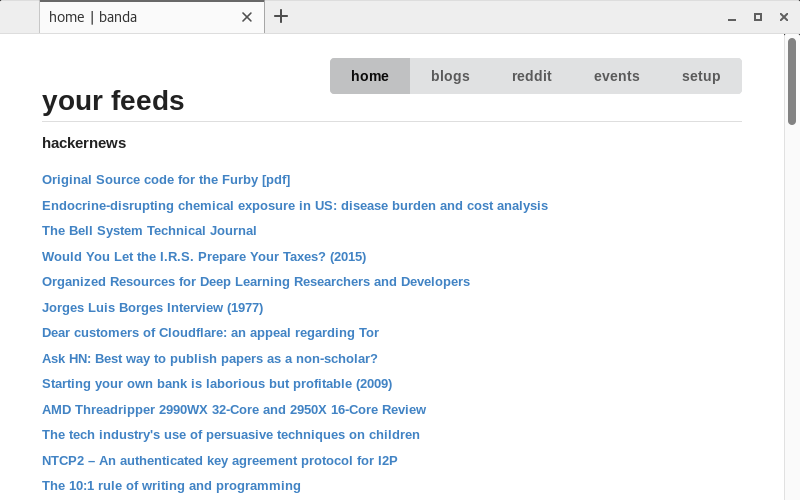

## banda

a privacy-respecting, hackable, simple yet powerful rss reader.

#### How to get started:

1) Make sure you have Python 3 installed on your machine.

2) Install the dependencies listed in the requirements.txt 

    `pip3 install -r requirements.txt`

#### screenshots

